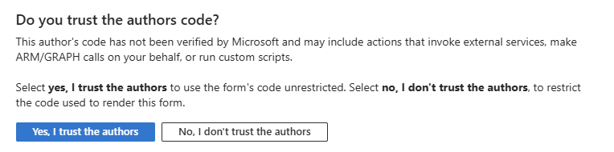

# Agentic inventory planning and trend forecasting with Microsoft Foundry and xAI models

## Overview

This sample demonstrates an agentic application built with Microsoft Foundry, Microsoft Foundry prompt agents, Agent Framework and xAI models, MCP tools, and a web frontend.

The application implements a domain-specific multi-agent workflow for retail inventory planning and trend forecasting. It includes infrastructure-as-code, generated sample data, backend orchestration, prompt-agent provisioning, and a deployable frontend experience.

Deploy without wizard:

[](https://portal.azure.com/#view/Microsoft_Azure_CreateUIDef/CustomDeploymentBlade/uri/https%3A%2F%2Fraw.githubusercontent.com%2FFoundry-Industry-Sandbox%2Fgrok-inventory-and-trend%2Frefs%2Fheads%2Fmain%2Finfra%2FmainTemplate.json)

Deploy with the UI wizard (requires consent):

[](https://portal.azure.com/#view/Microsoft_Azure_CreateUIDef/CustomDeploymentBlade/uri/https%3A%2F%2Fraw.githubusercontent.com%2FFoundry-Industry-Sandbox%2Fgrok-inventory-and-trend%2Frefs%2Fheads%2Fmain%2Finfra%2FmainTemplate.json/createUIDefinitionUri/https%3A%2F%2Fraw.githubusercontent.com%2FFoundry-Industry-Sandbox%2Fgrok-inventory-and-trend%2Frefs%2Fheads%2Fmain%2Finfra%2FcreateUiDefinition.json)

> The Deploy to Azure button deploys the precompiled ARM template generated from the Bicep files in `/infra`. See [`docs/deployment-parameters.md`](./docs/deployment-parameters.md) for template parameters.

## Scenario

A retail planner submits a replenishment request for a SKU and store. Five specialized agents run in sequence—signal ingestion, feature and causality, forecasting, replenishment and allocation, and planner copilot—turning POS, inventory, supplier, and promotion signals into a draft purchase order. A human planner reviews budget and service-level constraints before approving the recommendation.

Five demo cases (`case-01` … `case-05`) cover seasonal demand, promotion spikes, supplier delays, partial fills, and demand anomalies.

## Architecture


See [docs/architecture.md](./docs/architecture.md) for the full topology and [workflow-summary.md](./workflow-summary.md) for the business reference.

Pipeline order:

`signal-ingestion-agent` → `feature-and-causality-agent` → `forecasting-agent` → `replenishment-and-allocation-agent` → `planner-copilot-agent` → human approval (client-side)

## What this sample demonstrates

- Multi-agent orchestration with Agent Framework.
- Prompt-agent provisioning in Microsoft Foundry.
- Use of xAI models through Microsoft Foundry (Grok 4.6 for reasoning).
- Retrieval-augmented generation over domain-specific data (Foundry IQ policies, lexical signal search, local knowledge files).
- MCP-based tool access from backend agents.
- End-to-end deployment using Bicep and ARM.
- A frontend experience for running and inspecting the workflow.
- Responsible AI touchpoints such as tracing, evaluation, and human approval.

## Repository structure

| Path | Description |
|---|---|
| `/agent-provisioning` | Scripts and definitions used to create Microsoft Foundry prompt agents. |
| `/backend` | Backend application, main Agent Framework workflow, MCP servers, and REST API used by the frontend. |
| `/data-generation` | Scripts and source assets used to generate synthetic demo data. |
| `/dataset-seed` | Generated sample dataset used by the application. |
| `/docs` | Additional documentation, diagrams, walkthroughs, and design notes. |
| `/frontend` | Frontend application used to run the workflow and inspect results. |
| `/infra` | Bicep templates, compiled ARM templates, and deployment scripts for Azure. |
| `README.md` | Main entry point for understanding, deploying, and running the sample. |

## Prerequisites

Required:
- Azure subscription.
- Access to Microsoft Foundry.
- Access to the required xAI (Grok 4.6) and embedding models in Microsoft Foundry.

Optional:
- Python 3 (only if regenerating demo data under `/data-generation`).
- Microsoft Fabric workspace (only when enabling Fabric integration at deploy time).

## Quick deploy

1. Click **Deploy to Azure**.
2. Select the target subscription and resource group.
3. Provide the required model, region, and application parameters. See [`docs/deployment-parameters.md`](./docs/deployment-parameters.md).
4. Wait for the ARM deployment to complete, then confirm the post-deploy container group succeeds (the jobs typically take 15–30 minutes).
5. Open the deployed frontend URL from the deployment output (`retailSiteUrl`).

> Deployment provisions the Azure resources required to run the sample application. It does not regenerate the synthetic dataset.

Microsoft Fabric integration is **optional**. To enable it, complete the pre-deploy identity steps in [docs/fabric-setup.md](./docs/fabric-setup.md) before deploying with `enableFabric=true`.

## Local development

### 1. Provision infrastructure

See [`infra/README.md`](./infra/README.md).

### 2. Provision Foundry prompt agents

See [`agent-provisioning/README.md`](./agent-provisioning/README.md).

### 3. Start the backend

See [`backend/README.md`](./backend/README.md).

### 4. Start the frontend

See [`frontend/README.md`](./frontend/README.md).

## Configuration

See [`docs/configuration.md`](./docs/configuration.md) for environment variables and Azure resource settings.

## Demo walkthrough

1. Open the frontend (`retailSiteUrl` after deploy, or `http://localhost:5147` locally).
2. Select or review the sample dataset (cases `case-01` … `case-05`).
3. Start the workflow.
4. Inspect each agent step.
5. Review retrieved context, tool calls, model outputs, and final recommendation.
6. Approve or reject the human-in-the-loop decision, when applicable.
7. Export or inspect the final result.

See [docs/demo-script.md](./docs/demo-script.md) for a seller-ready talk track.

## Cost and cleanup

This sample creates Azure resources that may incur costs.

Cost analysis and monthly estimates cover Search, Container Apps, Foundry models, and Log Analytics.

- Conservative monthly infrastructure floor: about USD 305.27.
- Estimated variable AI unit costs:
	- Agent operation (`invoke_agent`): about USD 0.069 per operation.
	- Chat call (all agents, blended): about USD 0.119 per call.
- Medium usage projection (1,500 agent operations/month): about USD 408.77 per month.

Primary optimization opportunities:

- Review and right-size Azure Cognitive Search capacity (largest cost driver).
- Reduce idle Azure Container Apps consumption (idle CPU/memory ~74% of Container Apps spend).
- Reduce high-frequency technical traffic and polling (notably health, case listing, and execution status endpoints).

For assumptions, formulas, and service-level breakdowns, see [Client cost analysis](./docs/Client_cost_analysis.md) and [Technical cost methodology](./docs/Technical_cost_calculation_methodology_rebuilt.md).

To avoid continued charges, delete the resource group after completing the demo.

```bash
az group delete --name <resource-group-name> --yes --no-wait
```

## Implementation choices and TODOs

### Prompt agents vs hosted agents

This sample uses **Microsoft Foundry prompt agents** provisioned from `agent-provisioning/`. We initially evaluated **hosted agents**, but the first Agent Framework workflow runs failed when executing agents with:

```text
Required property 'logprobs' is missing
```

The only public reference we found for this error is [microsoft/agent-framework#5854](https://github.com/microsoft/agent-framework/issues/5854). Until that issue is resolved, use prompt agents for Agent Framework orchestration in this sample.

### UI-only workflow completion

The final step of the demo workflow is shown in the **frontend only**; the outcome is **not persisted** by the backend API. Planner approval does **not** add the recommended promotion or product changes to the operational dataset.

### Microsoft Fabric integration

Optional Fabric support is implemented at the **MCP layer only**: agents read structured planning signals through MCP tools, which can switch between local `dataset-seed` and Fabric OneLake via `DataSource:Mode`. Ingest, RAG, policies, and the scenario catalog stay on bundled local assets by design.

To enable Fabric, follow [docs/fabric-setup.md](./docs/fabric-setup.md).

## Known limitations

- This sample is not production-ready.
- The dataset is synthetic.
- The workflow is optimized for demonstration clarity, not throughput.
- Workflow executions are kept in memory and are lost if the API restarts.
- Human approval is client-side only; there is no backend resume endpoint.
- Some deployment settings may require adjustment based on region, quota, and model availability.
- Responsible AI, security, monitoring, and compliance controls must be reviewed before production use.

## Known issues

For the scenario where you want to deploy the solution using the UI wizard, note that the UI definition calls Azure REST APIs to get model capacities for the region where you want to deploy the Foundry models. This requires user consent and displays the following dialog:



## Related documentation

- [Documentation index](./docs/README.md)
- [Architecture](./docs/architecture.md)
- [Deployment parameters](./docs/deployment-parameters.md)
- [Fabric setup (optional)](./docs/fabric-setup.md)
- [Data model](./docs/data-model.md)
- [Agent governance](./docs/agent-foundry-governance.md)
- [Responsible AI](./docs/responsible-ai.md)
- [Troubleshooting](./docs/troubleshooting.md)
- [Workflow summary](./workflow-summary.md)

## License

See [LICENSE](./LICENSE.txt) if present in the repository.

## Acknowledgments

The code in this repository was built by the engineering team at [SOUTHWORKS](https://www.southworks.com/). We gratefully acknowledge their expertise and contributions, which made this project possible.
