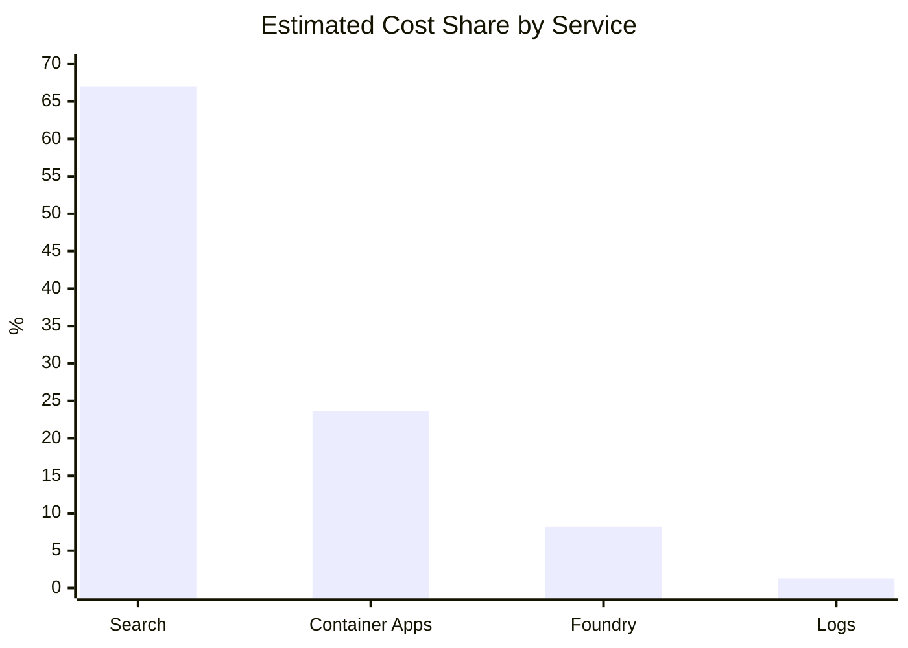

Application cost analysis
Executive summary for client presentation
Currency: USD

# 1. Executive summary

The solution combines provisioned infrastructure costs and variable costs associated with AI model usage. The main optimization opportunity is base infrastructure (especially Azure Cognitive Search and idle Container Apps), plus high-frequency technical traffic from the frontend.

| Monthly base projection | USD 305.27 |
| --- | --- |
| Conservative floor = provisioned Search + Container Apps idle, multiplied by 30 days. |

| Variable AI cost per agent operation | USD 0.069 |
| --- | --- |
| Estimated Foundry spend per `invoke_agent` operation. |

| Variable AI cost per chat call (blended) | USD 0.119 |
| --- | --- |
| Blended Foundry spend per chat call across agents. |

| Non-AI infrastructure cost per day | USD 10.68 |
| --- | --- |
| Average daily Search + Container Apps + Logs cost, excluding Foundry. |

# 2. Cost distribution

| Service | Cost share |
| --- | --- |
| Azure Cognitive Search | 67.0% |
| Azure Container Apps | 23.6% |
| Foundry Models | 8.2% |
| Log Analytics | 1.3% |

# 3. Costs by execution type

| Execution type | Estimated variable cost | Notes |
| --- | --- | --- |
| Agent operation (invoke_agent) | USD 0.069 | Marginal Foundry cost per agent operation. |
| Chat call (all agents) | USD 0.119 | Blended Foundry cost per chat call. |
| Base infrastructure day | USD 10.68 | Search + Container Apps + Logs without Foundry spend. |

> Unit values represent estimated operating costs for this inventory-planning workload. They are not directly comparable to ingestion/query/curation values from other projects.

# 4. Monthly projection

Model used: monthly cost = base infrastructure + (agent operations x 0.069).

| Scenario | Agent operations / month | Variable | Monthly total |
| --- | --- | --- | --- |
| Low | 500 | USD 34.50 | USD 339.77 |
| Medium | 1,500 | USD 103.50 | USD 408.77 |
| High | 5,000 | USD 345.00 | USD 650.27 |

```mermaid
xychart-beta
    title "Monthly Cost Projection by Scenario"
    x-axis ["Low", "Medium", "High"]
    y-axis "USD / month" 0 --> 700
    bar "Base Infrastructure" [305, 305, 305]
    bar "Variable Usage" [35, 104, 345]
```

# 5. Findings and recommendations

- Azure Cognitive Search is the main cost driver (~67% of spend).
- About 74% of Container Apps spend is idle CPU/memory, indicating a strong right-sizing opportunity.
- Agents run primarily on grok-4.7; chat prompts are large relative to output, so prompt sizing and caching are relevant savings levers.
- Frontend traffic is dominated by technical endpoints (`GET /health`, `GET api/inventory-planning/cases`) and execution status polling. Reducing that traffic lowers load, logs, and scaling needs.
- Per-flow unit costing (ingestion/query/curation style) is not used for this sample; cost is modeled by agent operations and blended chat calls.

# 6. Conclusion

With the current configuration, the conservative monthly floor is estimated at approximately USD 305, before AI usage is added. For a medium scenario of 1,500 agent operations per month, the total projection is approximately USD 409. The highest-impact actions are Search capacity review, Container Apps idle optimization, and reducing high-frequency technical requests.
