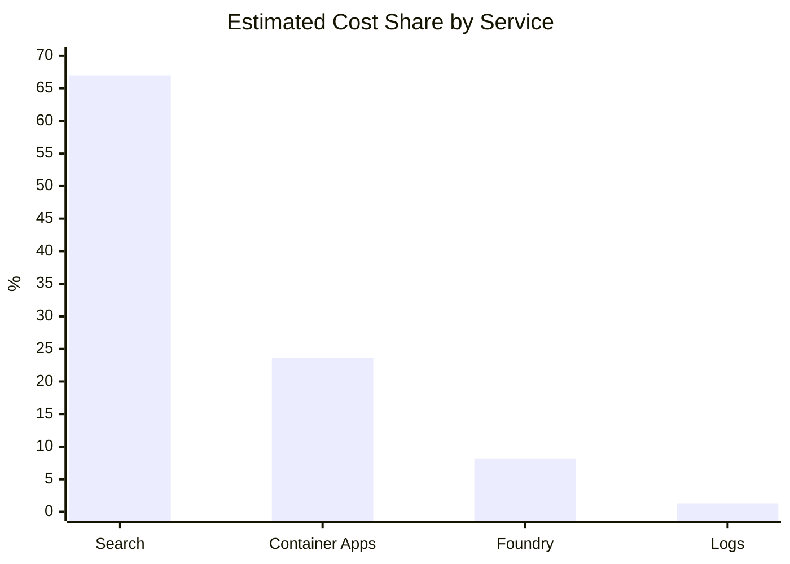

# Technical methodology for cost analysis

Complete calculations, assumptions, and Kusto queries for replication.
Currency: USD

## 1. Scope and sources

This document describes how to reproduce the cost analysis by combining Cost Management, Application Insights, and Log Analytics. The following sources are used:

- Cost export by resource and meter.
- Foundry model cost export by product.
- Agent Framework telemetry for requests, dependencies, and gen_ai dimensions.
- Results from Kusto queries executed over the same time interval as the cost export.

> Consistency rule: all queries must use the same UTC range as the Cost Management export. Exclude partial days when estimating the daily infrastructure base.

## 2. Cost model inputs

| Service | Role in the model | Typical share |
| --- | --- | --- |
| Azure Cognitive Search | Base / provisioned | ~67% |
| Azure Container Apps | Base (idle) + approximate variable (active) | ~24% |
| Foundry Models | Variable (tokens / chat) | ~8% |
| Log Analytics | Approximate variable (telemetry volume) | ~1% |



## 3. Separation between fixed and variable costs

Classification used for the model:

| Component | Classification | Criteria |
| --- | --- | --- |
| Azure AI Search | Base / provisioned | Billed by provisioned capacity; queries impact load and scaling, but not necessarily immediate cost. |
| Container Apps - Idle | Base | Reserved CPU and memory with no active processing. |
| Container Apps - Active | Approximate variable | Increases with execution duration and load. |
| Foundry Models | Variable | Depends on tokens and chat volume. |
| Log Analytics | Approximate variable | Depends on ingested telemetry volume. |

Container Apps idle share used in the estimate: ~74%.

Conservative monthly base:

```bash
Monthly_base = (Search_daily + ContainerApps_idle_daily) × 30
Monthly_base ≈ USD 305.27
```

Non-AI infrastructure day estimate: USD 10.68.

## 4. Functional volume and telemetry

For unit costing, use functional agent operations (`invoke_agent`) and chat calls, not total HTTP requests. A large share of request volume corresponds to health checks, case listing, and status polling.

## 5. Unit cost calculation

### 5.1 Agent operation

```bash
Agent_operation_cost = Foundry_variable_spend / agent_operation_count
Agent_operation_cost ≈ USD 0.069
```

### 5.2 Chat call (blended)

```bash
Chat_call_cost = Blended_Foundry_spend / chat_call_count
Chat_call_cost ≈ USD 0.119
```

### 5.3 Monthly formula

```bash
Monthly cost = Monthly base + (Agent operations × 0.069)
```

| Scenario | Base | Variable | Total |
| --- | --- | --- | --- |
| Low (500 ops) | USD 305.27 | USD 34.50 | USD 339.77 |
| Medium (1,500 ops) | USD 305.27 | USD 103.50 | USD 408.77 |
| High (5,000 ops) | USD 305.27 | USD 345.00 | USD 650.27 |

## 6. Non-functional traffic finding

High-frequency technical traffic increases load, telemetry, and scaling risk without contributing proportional business value. Endpoints to monitor when validating estimates:

- `GET /health`
- `GET api/inventory-planning/cases`
- `GET api/inventory-planning/executions/{executionId}/basic/status`

Reducing polling and repeated listing calls should be applied before treating the sample as a production cost reference.

## 7. Kusto queries to reproduce the analysis

Replace `startDate` / `endDate` with the UTC range that matches the Cost Management export.

### 7.1 Daily summary of requests, dependencies, and agents

```kusto
let startDate = datetime(YYYY-MM-DD);
let endDate = datetime(YYYY-MM-DD);
union
(requests | where timestamp between (startDate .. endDate) | summarize Value=count() by Day=startofday(timestamp) | extend Metric="HTTP Requests"),
(dependencies | where timestamp between (startDate .. endDate) | summarize Value=count() by Day=startofday(timestamp) | extend Metric="Dependencies"),
(dependencies | where timestamp between (startDate .. endDate) | where name contains "invoke_agent" | summarize Value=count() by Day=startofday(timestamp) | extend Metric="Agent Operations")
| project Day, Metric, Value
| order by Day asc, Metric asc
```

### 7.2 Tokens by agent and model

```kusto
dependencies
| extend Operation=tostring(customDimensions["gen_ai.operation.name"]),
         Agent=tostring(customDimensions["gen_ai.agent.name"]),
         Model=tostring(customDimensions["gen_ai.response.model"]),
         InputTokens=tolong(customDimensions["gen_ai.usage.input_tokens"]),
         OutputTokens=tolong(customDimensions["gen_ai.usage.output_tokens"]),
         ReasoningTokens=tolong(customDimensions["microsoft.foundry.reasoning.tokens"]),
         CachedTokens=tolong(customDimensions["gen_ai.usage.cache_read.input_tokens"])
| where Operation == "chat"
| summarize Calls=count(), TotalInputTokens=sum(InputTokens), TotalOutputTokens=sum(OutputTokens),
            TotalReasoningTokens=sum(ReasoningTokens), AvgInputTokens=round(avg(todouble(InputTokens)),0),
            AvgOutputTokens=round(avg(todouble(OutputTokens)),0), AvgReasoningTokens=round(avg(todouble(ReasoningTokens)),0) by Agent, Model
| order by Calls desc
```

### 7.3 Tokens by agent, model, and day

```kusto
dependencies
| extend Operation=tostring(customDimensions["gen_ai.operation.name"]),
         Agent=tostring(customDimensions["gen_ai.agent.name"]),
         Model=tostring(customDimensions["gen_ai.response.model"]),
         InputTokens=tolong(customDimensions["gen_ai.usage.input_tokens"]),
         OutputTokens=tolong(customDimensions["gen_ai.usage.output_tokens"]),
         ReasoningTokens=tolong(customDimensions["microsoft.foundry.reasoning.tokens"]),
         CachedTokens=tolong(customDimensions["gen_ai.usage.cache_read.input_tokens"])
| where Operation == "chat"
| summarize ChatCalls=count(), InputTokens=sum(InputTokens), OutputTokens=sum(OutputTokens),
            ReasoningTokens=sum(ReasoningTokens), CachedInputTokens=sum(CachedTokens) by Day=startofday(timestamp), Agent, Model
| order by Day asc, Agent asc
```

### 7.4 Azure Search operations

```kusto
dependencies
| where target contains ".search.windows.net"
| summarize Calls=count(), Successful=countif(success == true), Failed=countif(success == false),
            AvgDurationMs=round(avg(duration),2), P95DurationMs=round(percentile(duration,95),2) by Day=startofday(timestamp), name
| order by Day asc, Calls desc
```

### 7.5 Frontend polling and technical traffic

```kusto
requests
| where name contains "/health" or name contains "/cases" or name contains "/status"
| summarize Requests=count() by Day=startofday(timestamp), name
| order by Day asc, Requests desc
```

### 7.6 Requests by endpoint and performance

```kusto
requests
| summarize Requests=count(), Successful=countif(success == true), Failed=countif(success == false),
            AvgDurationMs=round(avg(duration),2), P95DurationMs=round(percentile(duration,95),2),
            P99DurationMs=round(percentile(duration,99),2) by name, resultCode
| extend SuccessRate=round(100.0 * Successful / Requests,2)
| order by Requests desc
```

### 7.7 Billable log volume by table

```kusto
union withsource=TableName *
| summarize Records=count(), EstimatedSizeMB=sum(_BilledSize)/1024.0/1024.0 by Day=startofday(TimeGenerated), TableName
| order by Day asc, EstimatedSizeMB desc
```

## 8. Reproduction procedure

1. Export Cost Management with daily granularity and columns ServiceName, Meter, ResourceId, and CostUSD.
2. Export Foundry costs separately by product/model for the same interval.
3. Run the Kusto queries over the same UTC range.
4. Identify full days and exclude partial days from daily base estimation.
5. Separate provisioned costs (Search and idle) from variable costs (Foundry, active compute, and logs).
6. Calculate functional volumes by agent operations and chat calls, not by total HTTP requests.
7. Attribute tokens using spans where gen_ai.operation.name = chat.
8. Apply the monthly formula and document volume assumptions.

## 9. Limitations and instrumentation improvements

- There are no consistent customDimensions for executionId, sessionId, or workflow.execution_id; operation_Id is not preserved across all hops.
- For this reason, some costs are attributed by aggregation rather than individual trace.
- Adding workflow.execution_id, workflow.type, session_id, and case_id to requests, dependencies, and spans would allow exact workflow-level costing.
- The monthly base depends on Search Units tier and quantity. It must be recalculated if capacity changes.
- Unit costs depend on prompt size, conversation length, number of tools, and current contractual pricing.

## 10. Central estimate

Central values used: monthly base USD 305.27; agent operation USD 0.069; chat call USD 0.119. Recalculate periodically with a larger sample and after technical-traffic and idle-capacity optimizations.
