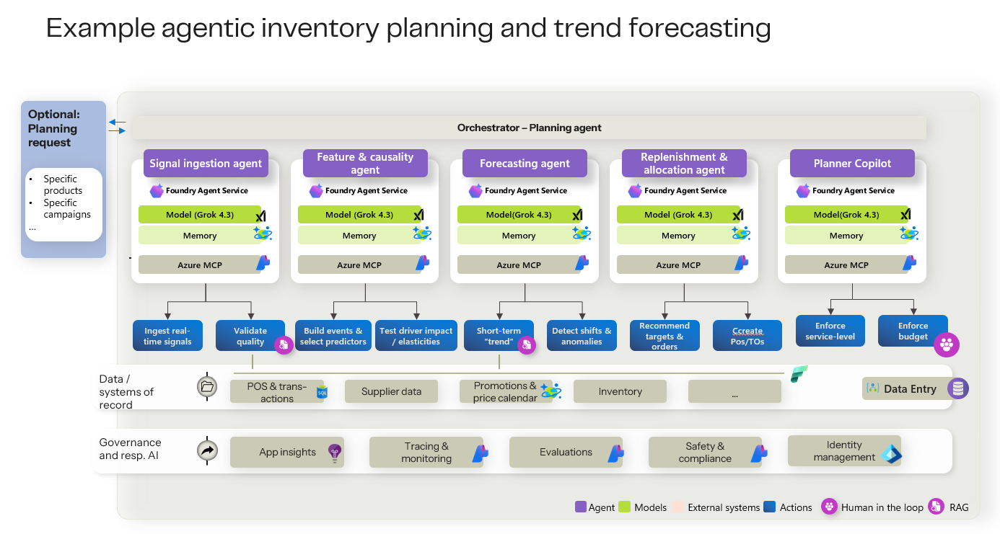
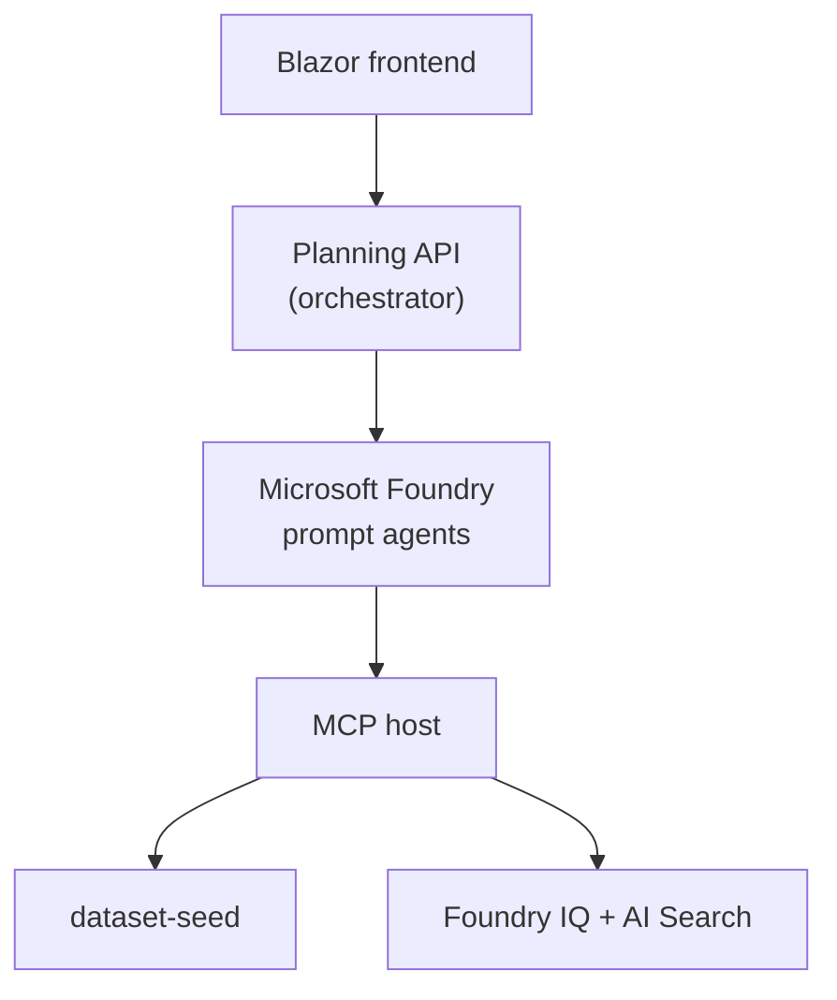

# Architecture

## High-level architecture

See also [workflow-summary.md](../workflow-summary.md) for the business-oriented diagram.

## Agent topology

| Stage | Foundry agent | MCP endpoint |
|---|---|---|
| 1 | `signal-ingestion-agent` | `/signal-ingestion/mcp` |
| 2 | `feature-and-causality-agent` | `/feature-and-causality/mcp` |
| 3 | `forecasting-agent` | `/forecasting/mcp` |
| 4 | `replenishment-and-allocation-agent` | `/replenishment-and-allocation/mcp` |
| 5 | `planner-copilot-agent` | `/planner-copilot/mcp` |

The orchestrator (API) is external to agent provisioning and coordinates the sequence via Agent Framework. See [agent-foundry-governance.md](./agent-foundry-governance.md) for governance posture.

## Workflow sequence

1. User selects a demo case and starts the workflow.
2. API creates an `executionId` and invokes agents sequentially.
3. Each agent returns structured JSON (`summary`, `decision`, `evidence`).
4. Planner copilot output is presented for client-side human approval.

## Data flow

- **Ingest documents** — API serves flat files from `dataset-seed/cases/{caseId}/ingest/`.
- **Signal tools** — MCP reads normalized JSON from `fabric-pre-requisite-data/` (or Fabric when enabled).
- **Policies** — `policies.json` is indexed at deploy time into Foundry IQ for constraint retrieval.
- **Workflow memory** — downstream agents consume prior agent outputs from the orchestrator context.

## MCP integration

Foundry agents call public HTTPS MCP endpoints on the MCP Container App. All tools require `caseId` and `executionId`. See [backend/GrokInventoryAndTrend.Mcp/README.md](../backend/GrokInventoryAndTrend.Mcp/README.md).

## Model usage

| Use | Model | Provider |
|---|---|---|
| Agent reasoning | Grok 4.3 | xAI via Foundry |
| Policy embeddings | text-embedding-3-small | OpenAI format via Foundry |
| Signal evidence rerank (optional) | Cohere-rerank-v4.0-fast | Cohere via Foundry |

Models are deployed through Microsoft Foundry as part of [`infra/main.bicep`](../infra/main.bicep).

## Deployment architecture

Bicep deploys Foundry, Search, Container Apps (API, MCP, frontend), and post-deploy jobs (IQ bootstrap, agent provisioning). Optional Fabric integration provisions a lakehouse and seeds demo data.

Template parameters are documented in [deployment-parameters.md](./deployment-parameters.md). Details: [infra/README.md](../infra/README.md).

## Security boundaries

- Managed identities connect services in Azure; no API keys in default deploy.
- MCP auth is open in the demo configuration.
- Human approval is client-side only and not persisted.
- Synthetic data only; no real customer PII.
